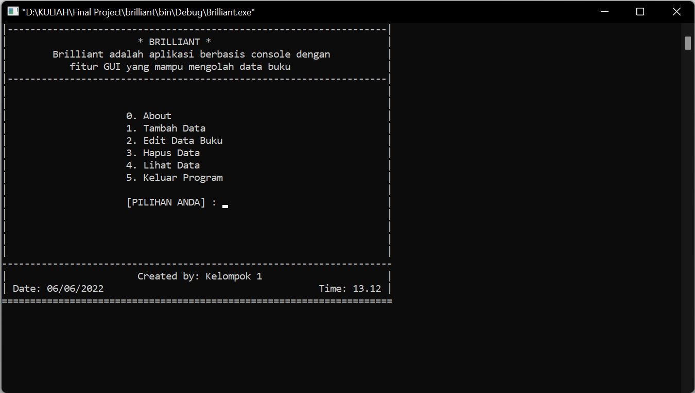
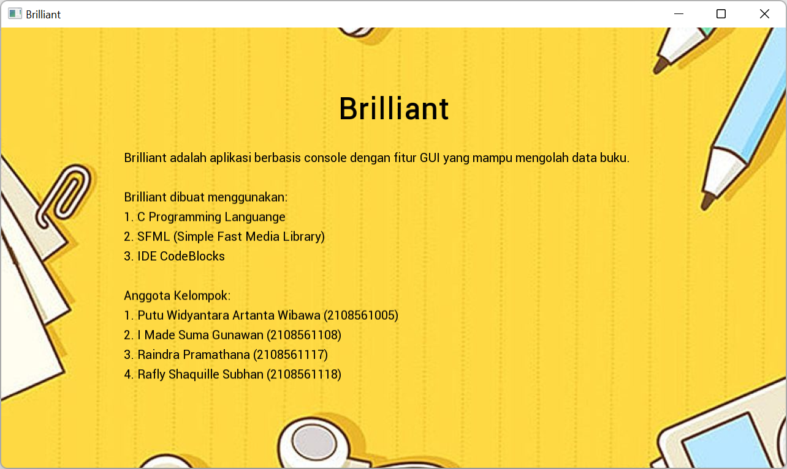
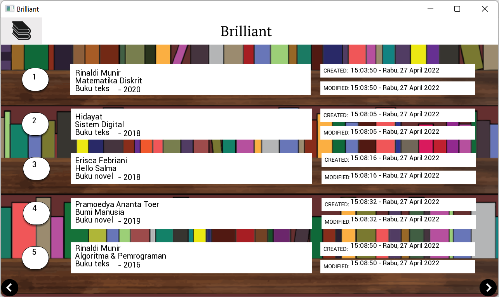

# Brilliant

<br>


Brilliant is a console-based application with GUI features that can manage book data.

## Introducing 👥

In this modern age, everything went digital. From your ordinary newspaper, advertisements, and even food delivery is now online. You can get everything done just with a touch of your finger. Including books! Brilliant makes it easier for you to access the database full of books.

## Features 💡

By using brilliant, you can:

-   [x] Create or add a book and save it into the database.
-   [x] Read or view the book data in GUI.
-   [x] Update the book that you have saved.
-   [x] Delete the book data.

## Technologies 👨‍💻

Brilliant is created using:

-   [C](https://www.open-std.org/jtc1/sc22/wg14/) - C as the programming language that we use to make modulation in our project.
-   [CodeBlocks](https://www.codeblocks.org/) - CodeBlocks as an IDE to develop this project.
-   [CSFML](https://www.sfml-dev.org/download/csfml/) - CSFML is the official binding of SFML for the C language as library to serve the GUI.

## Structure 📂

The image below shows the folder structure of our project.

```
Brilliant
├── assets
│   ├── font
│   └── image
├── data
├── doc
├── lib
├── .gitignore
├── Brilliant.cbp
├── LICENSE
├── README.md
└── main.c
```

-   [assets](assets/) contains 2 directories, fonts and images used in the project.
-   [data](data/) contains a text file which is used to store book data.
-   [doc](doc/) contains documentation about the project.
-   [lib](lib/) directory containing the headers we created in the program.
-   [.gitignore](.gitignore) is a file used to exclude some files such as object files (.o) and executable files (.exe).
-   [Brilliant.cbp](Brilliant.cbp) is CodeBlocks project file that contains information about the project.
-   [LICENSE](LICENSE) is a file containing the licenses we use in the project.
-   [README.md](README.md) is the file you are reading now, containing additional information about the project.
-   [main.c](main.c) is the main function in the file.

## Requirements 📦

-   CodeBlocks 20.03 or later
-   CSFML 2.5.1 or later
-   C17 or later

## Installation 🛠️

-   Move CSFML folder to:

```
C:\Program Files\CodeBlocks\csfml
```

-   Link libraries in CodeBlocks:

```
csfml-graphics-2
csmfl-window-2
```

-   Add compiler search directories:

```
C:\Program Files\CodeBlocks\csfml\include
```

-   Build and run.

## Preview 💻

Let's take some sneak peek about our project.

<div align="center">
  
  
  
</div>

## Contributors ✨

<br>
<table align="center">
  <tr>
    <td align="center"><a href="https://github.com/putuwaw"><br><sub><b>Putu Widyantara</b></sub></td>
    <td align="center"><a href="https://github.com/sugunjenk"><br><sub><b>Suma Gunawan</b></sub></td>
    <td align="center"><a href="https://github.com/RaindraP"><br><sub><b>Raindra Pramathana</b></sub></td>
    <td align="center"><a href="https://github.com/IseKey"><br><sub><b>Rafly Shaquille</b></sub></td>
  </tr>
</table>